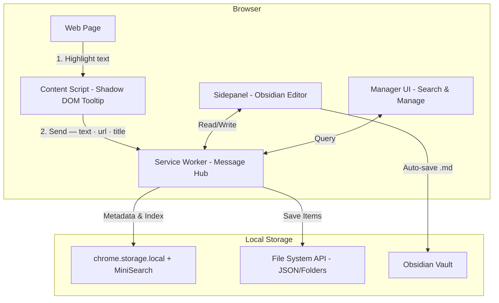
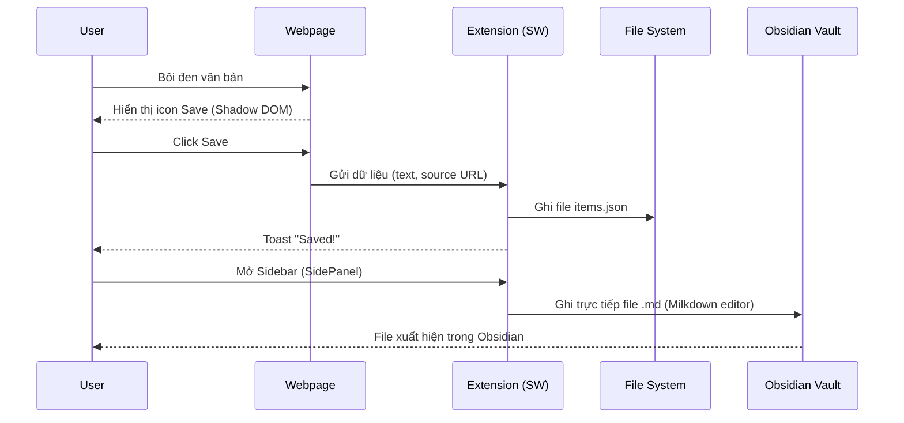

> Stop losing web research. Highlight any text, bypass site restrictions, and sync directly to your local file system or Obsidian vault. Zero cloud, full-text search.

---

# RawNotes 

**Highlight web text → Lưu local → Sync Obsidian.**

## 1. Kiến trúc hệ thống (Architecture)



## 2. Luồng hoạt động (Data Flow)



## 3. Cấu trúc thư mục cốt lõi

```text
raw-notes/
├── background/service_worker.js    # Hub xử lý data & file I/O
├── content/content_script.js       # Bắt sự kiện highlight, inject tooltip
├── sidepanel/                      # Giao diện Obsidian-like editor
├── manager/                        # Quản lý & MiniSearch
├── shared/                         # Logic dùng chung (Storage, Migration)
└── vendor/                         # Local libs (MiniSearch, Milkdown)
```

## 4. Onboarding / Local Setup

**Yêu cầu:** Chrome 114+ / Edge / Brave.

1. Clone repo.
2. Build Milkdown (chỉ làm 1 lần):
   ```bash
   cd vendor/milkdown && npm install && npm run build
   ```
3. Mở trình duyệt, truy cập `chrome://extensions/`.
4. Bật **Developer mode** (Góc trên bên phải).
5. Click **Load unpacked** → Chọn thư mục `raw-notes`.

## 5. Testing Onboarding

- **Unit/E2E Test:**
  ```bash
  npm install
  npm run web-
  npm run build:zip
  ```
- **Debug:** Mở Manager Page → View Logs. Mọi lỗi File System/Storage đều được lưu tại đây.